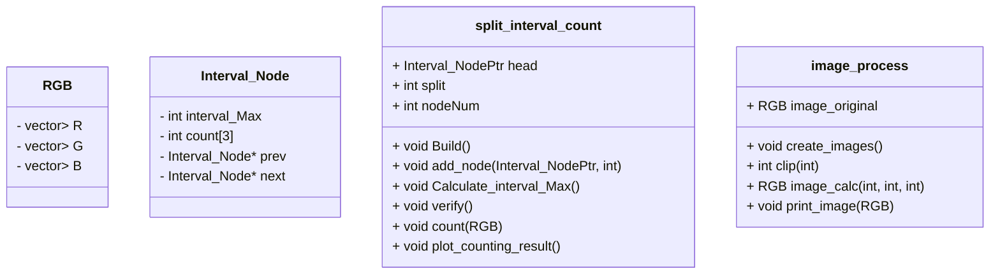

```mermaid
classDiagram
    class RGB {
        - vector<vector<int>> R
        - vector<vector<int>> G
        - vector<vector<int>> B
    }

    class Interval_Node {
        - int interval_Max
        - int count[3]
        - Interval_Node* prev
        - Interval_Node* next
    }

    class split_interval_count {
        + Interval_NodePtr head
        + int split
        + int nodeNum
        + void Build()
        + void add_node(Interval_NodePtr, int)
        + void Calculate_interval_Max()
        + void verify()
        + void count(RGB)
        + void plot_counting_result()
    }

    class image_process {
        + RGB image_original
        + void create_images()
        + int clip(int)
        + RGB image_calc(int, int, int)
        + void print_image(RGB)
    }

```